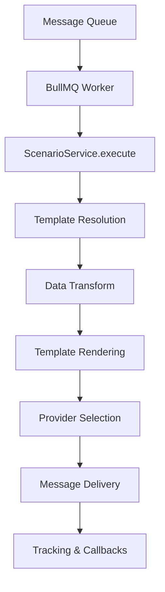

# TechSpear Messenger

Un système de messagerie multi-canal asynchrone basé sur une architecture de queue pour l'envoi d'emails, SMS, notifications push et webhooks.

## 🏗️ Architecture

### Vue d'ensemble

Le système Messenger est conçu autour d'une architecture basée sur des queues qui permet le traitement asynchrone des messages selon le pattern :

```
Queue → Worker → Scenario → Template → Transform → Provider → Destination
```

### Composants principaux

#### 1. **QueueMessage** - Interface de message standardisée

L'interface `QueueMessage` définit la structure des messages transitant dans le système :

```typescript
interface QueueMessage {
    // Identification et routage
    applicationId: string; // Application source (ex: 'mqr')
    scenarioId: string; // Scénario à exécuter (ex: 'mqr_welcome_email')

    // Données métier
    businessData: Record<string, any>; // Variables pour les templates

    // Destination
    to: string[]; // Destinataires
    cc?: string[]; // Copie conforme
    bcc?: string[]; // Copie conforme cachée
    subject?: string; // Sujet (override)

    // Métadonnées
    meta?: {
        priority?: 'low' | 'normal' | 'high';
        locale?: string;
        correlationId?: string;
        tags?: string[];
        createdAt?: string;
        expiresAt?: string;
    };

    // Options de livraison
    delivery?: {
        channel: 'email' | 'sms' | 'push' | 'webhook';
        retryPolicy?: RetryPolicy;
        scheduleAt?: string;
        ttl?: number;
    };

    // Suivi et observabilité
    tracking?: {
        messageId?: string;
        callbackUrl?: string;
        events?: ('queued' | 'sent' | 'delivered' | 'failed')[];
    };
}
```

#### 2. **Configuration centralisée**

Toute la configuration est centralisée dans le dossier `/src/config/` :

- **Applications** (`applications.ts`) : Définit les applications clientes
- **Queues** (`queues.ts`) : Configuration des queues Redis/BullMQ
- **Workers** (`workers.ts`) : Configuration des workers de traitement
- **Scenarios** (`scenarios.ts`) : Définit les scénarios d'envoi
- **Templates** (`templates.ts`) : Mapping des templates
- **Providers** (`providers.ts`) : Configuration des fournisseurs d'envoi

#### 3. **Factory Pattern**

Le système utilise des factories pour l'instanciation dynamique :

- **ProviderFactory** : Crée les instances de providers selon la configuration
- **WorkerFactory** : Instancie les workers appropriés pour chaque queue

### Flux de traitement



1. **Réception** : Un message `QueueMessage` arrive dans la queue
2. **Worker** : Le worker BullMQ traite le message
3. **Scénario** : Le `ScenarioService` identifie le scénario à exécuter
4. **Template** : Résolution des templates associés au scénario
5. **Transform** : Application des transformations de données
6. **Rendu** : Génération du contenu final via le moteur de templates
7. **Provider** : Sélection du provider approprié (Gmail, SendGrid, etc.)
8. **Envoi** : Livraison via le canal configuré
9. **Tracking** : Enregistrement des métriques et callbacks

## 🚀 Installation

### Prérequis

- Node.js >= 18
- Redis >= 6.0
- TypeScript

### Installation des dépendances

```bash
npm install
```

### Configuration

1. **Redis** : Assurez-vous que Redis est démarré sur `localhost:6379`
2. **Variables d'environnement** : Créez un fichier `.env` :

```env
REDIS_URL=redis://localhost:6379/0
NODE_ENV=development
```

### Développement

```bash
# Mode développement avec hot-reload
npm run dev

# Build
npm run build

# Production
npm start

# Format whole project
npm run format
```

## ⚙️ Configuration

### Exemple de configuration complète

#### Applications (`src/config/applications.ts`)

```typescript
export const applicationsConfig: ApplicationConfig[] = [
    {
        appId: 'mqr',
        name: 'MenuQR',
        description: 'Application de gestion de menus QR',
        scenarioIds: ['mqr_welcome_email', 'mqr_confirmation_email'],
    },
];
```

#### Scénarios (`src/config/scenarios.ts`)

```typescript
export const scenariosConfig: ScenarioConfig[] = [
    {
        scenarioId: 'mqr_welcome_email',
        description: 'Email de bienvenue utilisateur',
        templateIds: ['mqr_welcome_html', 'mqr_welcome_text'],
    },
];
```

#### Templates (`src/config/templates.ts`)

```typescript
export const templatesConfig: TemplateConfig[] = [
    {
        templateId: 'mqr_welcome_html',
        providerId: 'gmail',
        path: 'mqr_welcome.html',
        dataTransformFiles: ['user-transform.js'], // Optionnel
    },
];
```

#### Queues (`src/config/queues.ts`)

```typescript
export const queuesConfig: QueueConfig[] = [
    {
        queueId: 'tsd-messenger',
        topic: 'tsd.messenger',
        redisUrl: 'redis://localhost:6379/0',
        type: 'bullmq',
    },
];
```

## 📤 Utilisation

### Envoi d'un message simple

```typescript
import { QueueMessage } from './src/core/entities/queue-message';

const message: QueueMessage = {
    applicationId: 'mqr',
    scenarioId: 'mqr_welcome_email',
    to: ['user@example.com'],
    businessData: {
        userName: 'Jean Dupont',
        activationLink: 'https://app.example.com/activate?token=abc123',
    },
    delivery: { channel: 'email' },
};

// Ajout à la queue
await queue.add('process-message', message);
```

### Utilisation avec métadonnées avancées

```typescript
const advancedMessage: QueueMessage = {
    applicationId: 'mqr',
    scenarioId: 'mqr_confirmation_email',
    to: ['customer@example.com'],
    cc: ['admin@example.com'],
    businessData: {
        orderNumber: '12345',
        totalAmount: 29.99,
        items: [
            { name: 'Produit A', price: 19.99 },
            { name: 'Produit B', price: 9.99 },
        ],
    },
    meta: {
        priority: 'high',
        locale: 'fr-FR',
        correlationId: 'order-12345',
        tags: ['order', 'confirmation'],
    },
    delivery: {
        channel: 'email',
        retryPolicy: { maxRetries: 3, backoff: 'exponential', delay: 1000 },
        scheduleAt: '2024-01-15T10:00:00Z',
    },
    tracking: {
        callbackUrl: 'https://api.example.com/webhooks/message-status',
        events: ['sent', 'delivered', 'failed'],
    },
};
```

## 🔧 Extensibilité

### Ajout d'un nouveau provider

1. **Créer l'implémentation** :

```typescript
// src/providers/email/custom-provider.ts
import { Provider, ProviderResult } from './provider.interface';
import { QueueMessage } from '../../core/entities/queue-message';

export class CustomProvider implements Provider {
    readonly id = 'custom-provider';
    readonly supportedChannels = ['email'];

    async send(message: QueueMessage): Promise<ProviderResult> {
        // Implémentation custom
        return { success: true, providerMessageId: 'custom-12345' };
    }
}
```

2. **Enregistrer dans la factory** :

```typescript
// src/providers/provider-factory.ts
export class ProviderFactory {
    static create(config: ProviderConfig): Provider {
        const providers: Provider[] = [
            new MockProvider(),
            new CustomProvider(), // Nouveau provider
        ];
        // ...
    }
}
```

3. **Ajouter à la configuration** :

```typescript
// src/config/providers.ts
export const providersConfig: ProviderConfig[] = [
    {
        providerId: 'custom-provider',
        name: 'Custom Email Provider',
        types: ['email'],
        description: 'Notre provider custom',
    },
];
```

### Ajout de transforms de données

```typescript
// src/transforms/user-transform.ts
import { DataTransform } from './transform.type';

const userTransform: DataTransform = (data: any) => {
    return {
        ...data,
        userName: data.firstName + ' ' + data.lastName,
        greeting: `Bonjour ${data.firstName}`,
        timestamp: new Date().toISOString(),
    };
};

export default userTransform;
```

## 🛠️ Technologies utilisées

- **Node.js** + **TypeScript** : Runtime et langage
- **BullMQ** : Gestion des queues Redis
- **Redis** : Stockage des queues et cache
- **Handlebars** : Moteur de templates
- **Pino** : Logging structuré
- **Zod** : Validation de schémas

## 📊 Monitoring et observabilité

Le système inclut des mécanismes de suivi intégrés :

- **Logs structurés** via Pino
- **Correlation IDs** pour tracer les flux
- **Callbacks webhooks** pour les notifications de statut
- **Métriques de retry** et gestion d'erreurs
- **Tags personnalisés** pour la catégorisation
